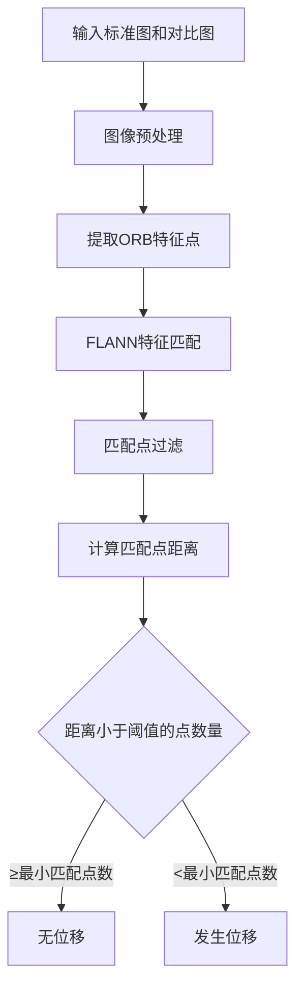
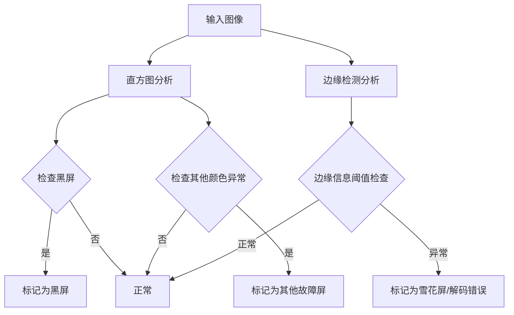

# 摄像头位移与故障检测算法技术文档

## 1. 系统概述

本系统是一个基于计算机视觉的摄像头监控质量检测工具，主要功能包括：
- **摄像头位移检测**：通过对比标准图像和采样图像，检测摄像头是否发生位移
- **故障屏检测**：检测监控画面是否出现黑屏、雪花屏等异常情况

## 2. 系统架构

### 2.1 核心组件
- `CameraShiftDetector`: 摄像头位移检测器
- `CameraScreenFaultyDetector`: 故障屏检测器
- `Main.py`: 主程序，支持三种运行模式

### 2.2 工作模式
- **模式A**: 仅进行故障屏检测
- **模式B**: 对所有NVR设备进行位移检测，然后对检测出位移的图像进行故障屏分析
- **模式C**: 对单一NVR设备进行位移检测和故障屏分析

## 3. 算法原理详解

### 3.1 摄像头位移检测算法

#### 3.1.1 算法流程


#### 3.1.2 核心技术

**1. 特征点检测 (ORB)**
- 使用ORB (Oriented FAST and Rotated BRIEF) 算法提取图像特征点
- 具有旋转不变性和尺度不变性
- 计算效率高，适合实时应用

**2. 特征匹配 (FLANN)**
- 使用快速近似最近邻搜索库(FLANN)进行特征匹配
- 采用KD-Tree算法提高匹配效率
- 支持大规模特征点集的快速匹配

**3. 匹配点过滤策略**
```python
def filterPoints(self, p1, p2, eps=0.00001):
    # 1. 区域一致性检查：两个匹配点必须在同一网格区域
    pt1_region = self.identifyPointRegion(p1[0], p1[1])
    pt2_region = self.identifyPointRegion(p2[0], p2[1])
    
    # 2. 角度变化检查：限制在±5度内 (tan(5°) ≈ 0.0874759)
    dx = p2[0] - p1[0]
    dy = p2[1] - p1[1]
    angle = dy / (dx + eps)
    
    return (-0.0874759 <= angle <= 0.0874759) and (pt1_region == pt2_region)
```

**4. 图像预处理**
- 裁剪图像上下10%区域，减少无关信息干扰
- 转换为灰度图像，提高处理速度
- 保持图像长宽比不变

### 3.2 故障屏检测算法

#### 3.2.1 算法流程


#### 3.2.2 检测策略

**1. 直方图分析**
```python
def analyseHistogram(self, im, h, w, threshold, slideWindowSize):
    hist = cv2.calcHist([im], [0], None, [256], [0,256])
    
    # 黑屏检测：检查低亮度像素比例
    blackCount1 = np.sum(hist[0:21])    # 极低亮度
    blackCount2 = np.sum(hist[21:41])   # 低亮度
    
    if blackCount1 > (h * w * threshold) or blackCount2 > (h * w * threshold):
        return True, False  # 黑屏
    
    # 其他异常检测：滑动窗口检查颜色集中度
    for i in range(41, 256 - slideWindowSize):
        pixel_count = np.sum(hist[i:i+slideWindowSize])
        if pixel_count > h * w * threshold:
            return False, True  # 其他故障
    
    return False, False  # 正常
```

**2. 边缘检测分析**
```python
def analyseEdge(self, gray, h, w):
    # 高斯模糊降噪
    blur = cv2.GaussianBlur(gray, (7, 7), 4)
    
    # Canny边缘检测
    edge = cv2.Canny(blur, 127, 200)
    
    # 计算边缘像素比例
    edge_ratio = np.count_nonzero(edge) / (w * h)
    
    # 边缘比例过高可能表示解码错误或雪花屏
    return edge_ratio > 0.1
```

## 4. 关键参数说明

### 4.1 位移检测参数
| 参数 | 默认值 | 说明 |
|------|--------|------|
| `splitN` | [3, 4] | 图像网格分割数量 (宽×高) |
| `threshold` | 4 | 位移距离阈值（像素） |
| `minMatchedPoints` | 2 | 最小有效匹配点数量 |
| `nfeatures` | 15000 | ORB特征点最大数量 |

### 4.2 故障检测参数
| 参数 | 默认值 | 说明 |
|------|--------|------|
| `slideWindowSize` | 20 | 直方图滑动窗口大小 |
| `threshold` | 0.7 | 像素集中度阈值 |
| `edge_threshold` | 0.1 | 边缘像素比例阈值 |

## 5. 使用方法

### 5.1 命令行参数
```bash
python Main.py \
    --mode B \
    --StandardDir /path/to/standard/images \
    --ComparisonDir /path/to/comparison/images \
    --SavePath /path/to/results \
    --threshold 4 \
    --splitN [3,3] \
    --nFeatures 15000
```

### 5.2 输出结果
系统会生成以下日志文件：
- `Shift.log`: 检测到位移的图像列表
- `BlackScreen.log`: 黑屏图像列表
- `SnowScreen.log`: 雪花屏/解码错误图像列表
- `OtherScreen.log`: 其他故障屏图像列表
- `Error.log`: 处理错误的图像列表
- `SumLog.json`: 结果汇总（JSON格式）

## 6. 代码优化建议

### 6.1 发现的问题

**1. 逻辑错误修复**
```python
# 原代码 (mClass.py 第30行)
elif self.standardIm.shape != self.comparisonIm.shape:
    return "ShapeError"

# 修复后
if self.standardIm.shape != self.comparisonIm.shape:
    return "ShapeError"
```

**2. 异常处理改进**
```python
# 原代码
except:
    # 处理逻辑

# 改进后
except (cv2.error, ValueError, IOError) as e:
    logging.error(f"处理图像时发生错误: {e}")
    # 处理逻辑
```

**3. 魔术数字参数化**
```python
class CameraShiftDetector:
    def __init__(self, 
                 crop_top_ratio=0.1,      # 顶部裁剪比例
                 crop_bottom_ratio=0.9,   # 底部裁剪比例
                 angle_tolerance=0.0874759,  # 角度容忍度
                 **kwargs):
        self.crop_top_ratio = crop_top_ratio
        self.crop_bottom_ratio = crop_bottom_ratio
        self.angle_tolerance = angle_tolerance
```

**4. 代码结构优化**
```python
# 添加数据类用于结果管理
from dataclasses import dataclass
from typing import List, Tuple

@dataclass
class DetectionResult:
    is_moved: bool
    is_black_screen: bool
    is_snow_screen: bool
    is_other_fault: bool
    matched_points: int
    error_message: str = ""
```

### 6.2 性能优化建议

1. **内存管理**: 及时释放大图像对象
2. **并行处理**: 使用多进程处理多个图像
3. **缓存优化**: 缓存已处理的标准图像特征
4. **GPU加速**: 考虑使用OpenCV的GPU模块

### 6.3 代码质量改进

1. **添加类型注解**: 提高代码可读性
2. **完善文档字符串**: 每个函数添加详细说明
3. **单元测试**: 添加测试用例确保算法正确性
4. **配置文件**: 使用YAML/JSON配置文件管理参数

## 7. 部署建议

### 7.1 环境要求
```
Python >= 3.7
opencv-python >= 4.0
numpy >= 1.18
```

### 7.2 性能监控
- 添加处理时间统计
- 监控内存使用情况
- 记录算法准确率指标

### 7.3 扩展性考虑
- 支持更多图像格式
- 添加深度学习检测模块
- 实现实时处理能力

## 8. 维护要点

1. **定期校准**: 根据实际使用情况调整阈值参数
2. **样本更新**: 定期更新标准图像库
3. **日志监控**: 关注错误日志，及时发现问题
4. **版本管理**: 记录算法变更和性能影响

## 9. 故障排除

### 9.1 常见问题
| 问题 | 可能原因 | 解决方案 |
|------|----------|----------|
| 大量误报 | 阈值设置不当 | 调整threshold参数 |
| 处理速度慢 | 特征点过多 | 减少nfeatures参数 |
| 内存不足 | 图像过大 | 添加图像缩放预处理 |

### 9.2 调试技巧
1. 启用详细日志记录
2. 保存中间处理结果
3. 使用可视化工具检查特征匹配效果